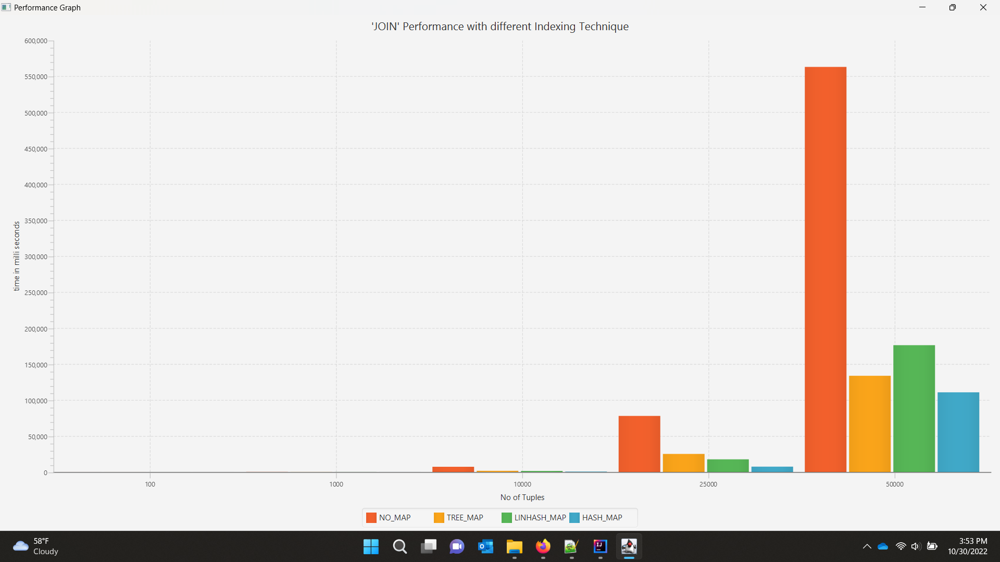
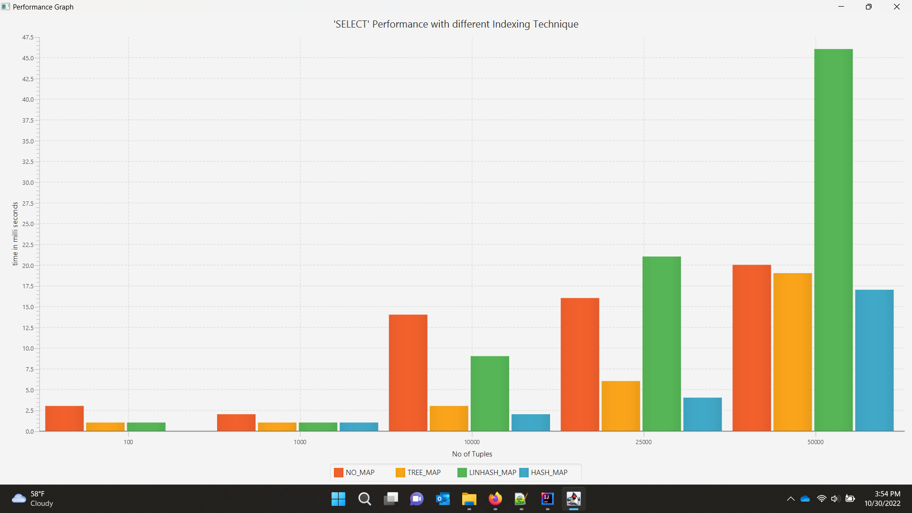

## Performance Evaluation of SELECT and JOIN operation with and without Indices

### Introduction
This project implements the index structure, Linear HashMap and evaluates the performance of SELECT and JOIN operators without using any indexing method and by using different indexing techniques - TreeMap, HashMap, Linear HashMap.

### Software Requirements
•	Java 11 JDK
•	Unzip

### Explanation of Files
Below are the descriptions of the all the files.
`LinHashMap.java` – Provides HashMaps using Linear Hashing Algorithm.
`PerformanceEval.java` - Executes SELECT and JOIN operations, record their execution times and generates a graph displaying the number of tuples vs execution time.
`Table.java` – Implements relational database tables and operators like SELECT, JOIN
`TestTupleGenerator.java`, `TupleGeneratorImpl.java` and `TupleGenerator.java` – Together they populate database with randomly generated values that satisfies the integrity constraints.

### How to execute
Preferably use an IDE like IntelliJ etc.
*mType= NO_MAP / TREE_MAP/ LINHASH_MAP/ HASH_MAP -
 • With chartDisplay=”None” - Generates the performance data in performance.txt
 • With chartDisplay=”Select/Join” - Generate the performance chart respectively.
*The number of tuples generated can be varied as per the requirements by changing the variable tuple_cnt in the PerformanceEval.java file.

### How to compile and run
Go to the root folder of the project
Run the following bash commands – 
•	javac PerformanceEval.java
•	java PerformanceEval

### Output:
Check the output of JOIN and SELECT performance with different type of Indexing Techniques:
 
 

### Contributors:
- Ratish Jha(@ratish11)
- Soumya Bharadwaj(@Soumya130498)
- Boby John Loganathan(@Bobyjohn)

